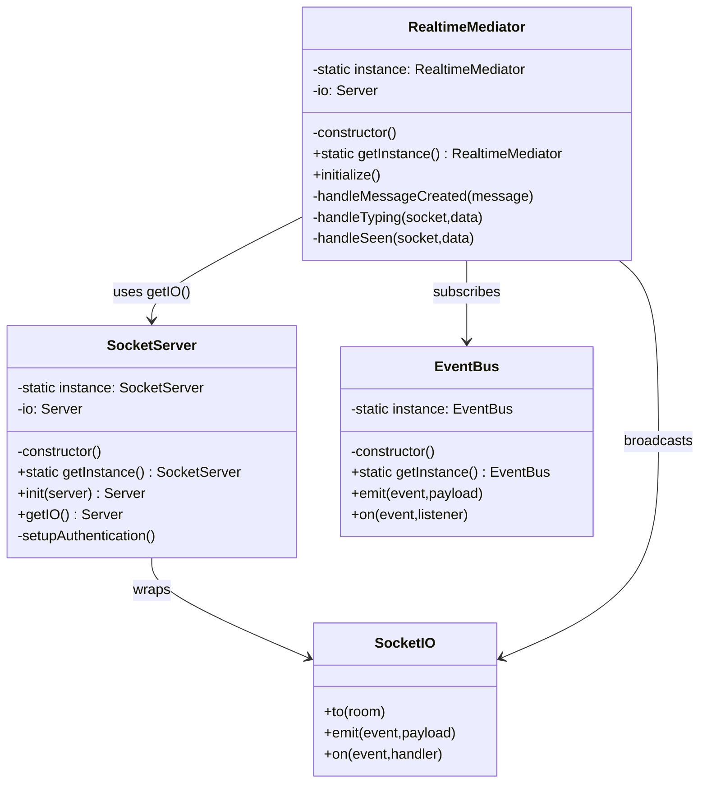
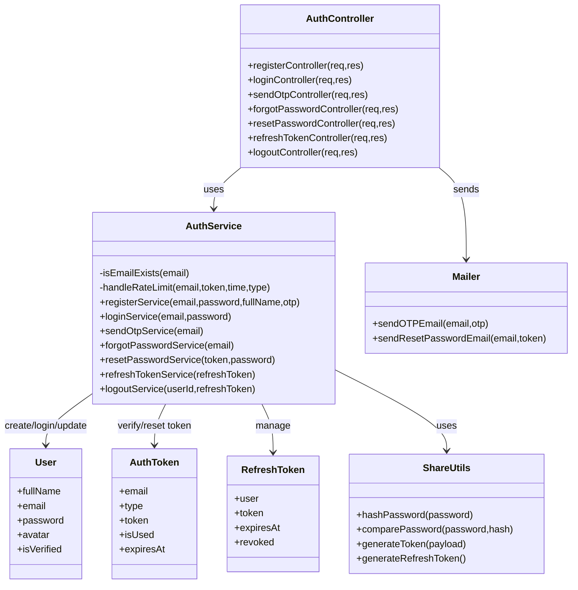
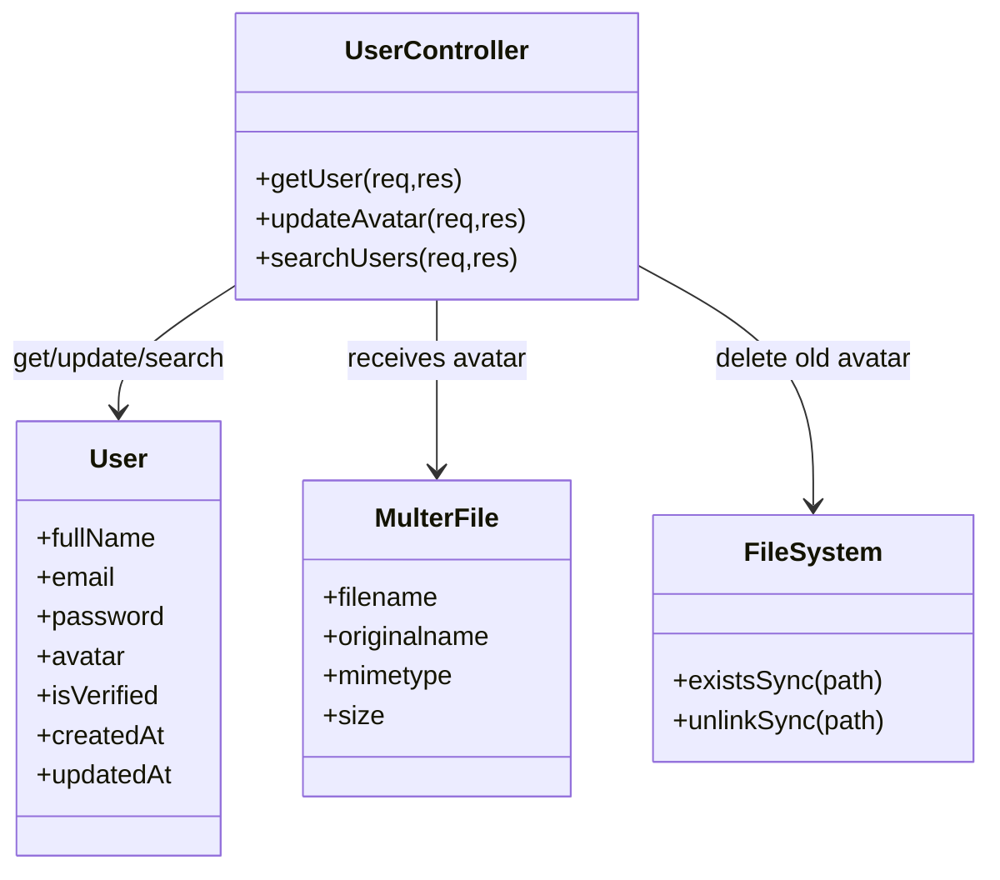
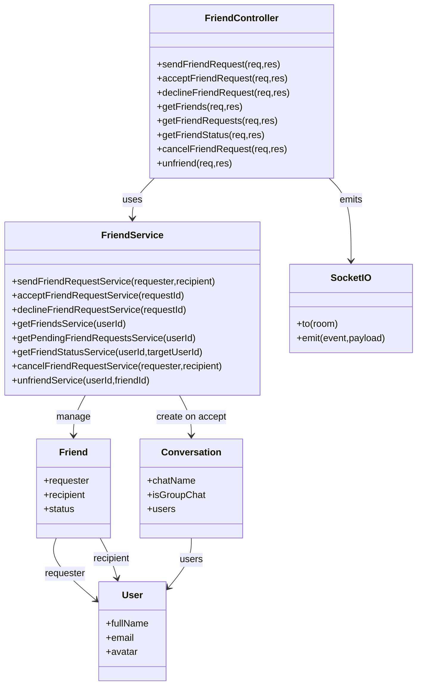
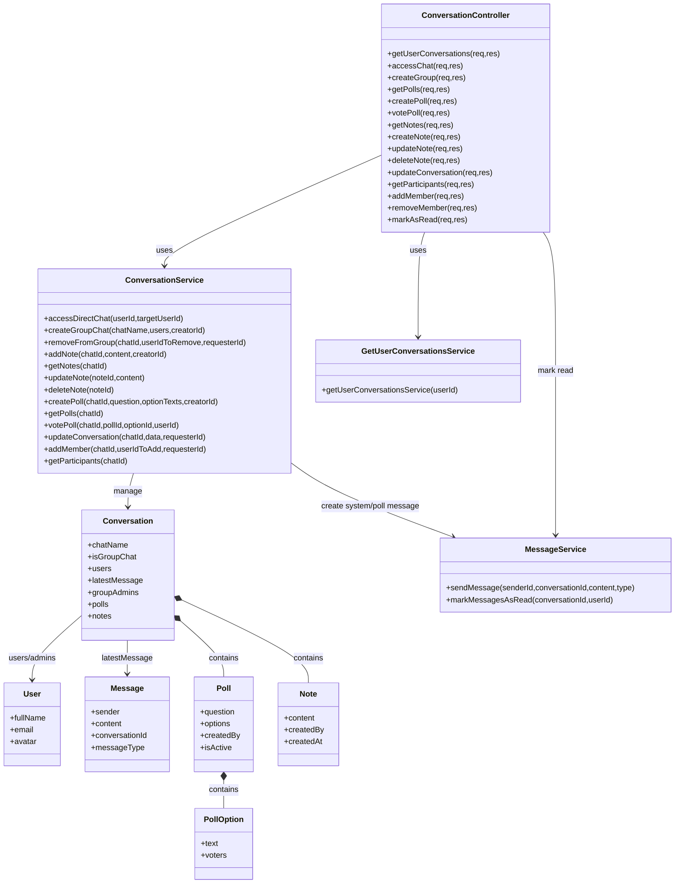
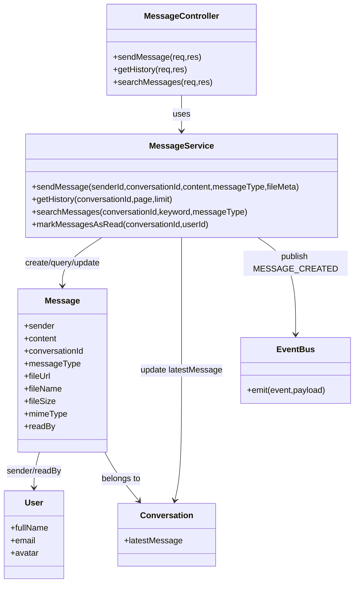
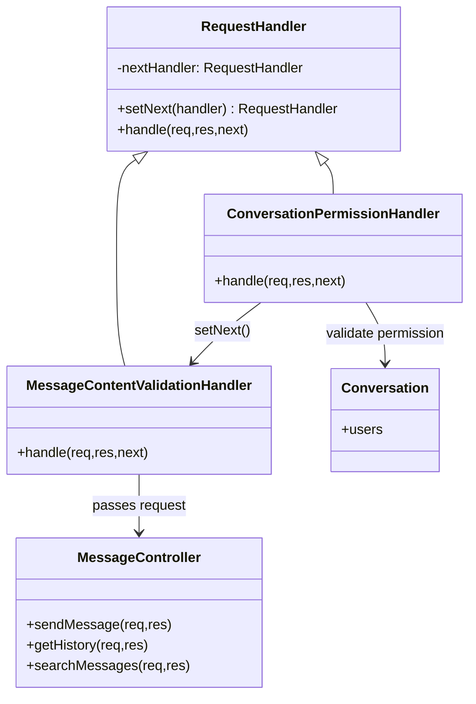
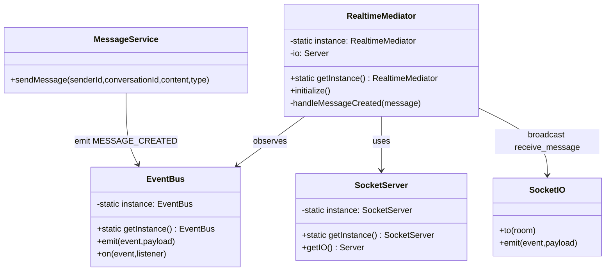
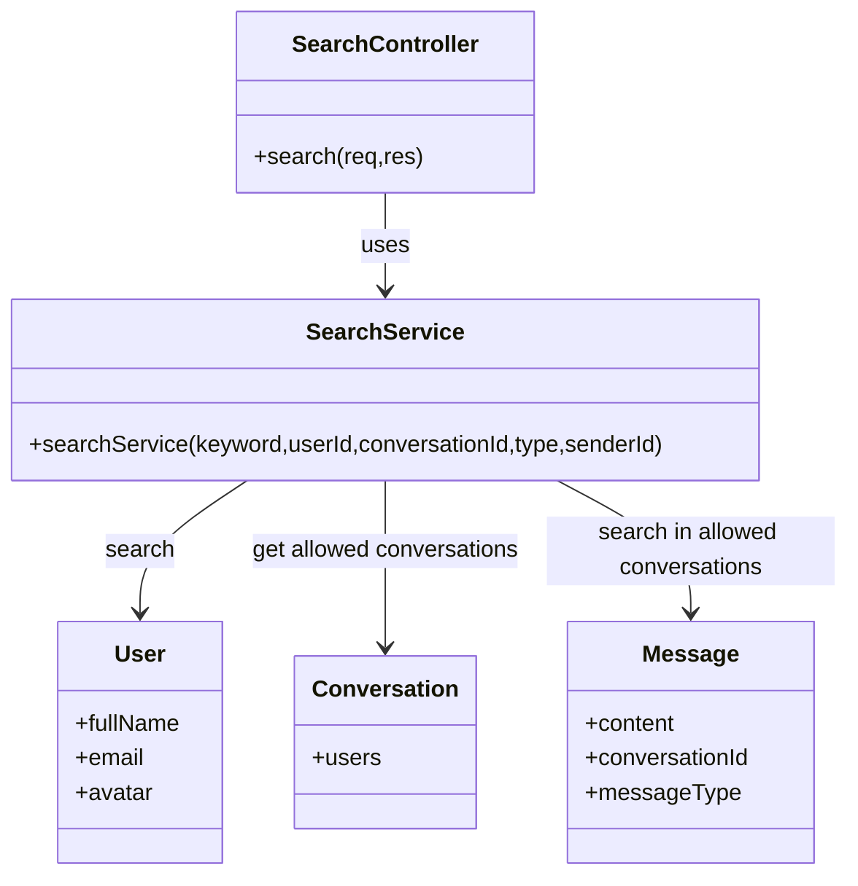

# Business Class Design Patterns

Tai lieu nay chi ve cac business class va design pattern theo dang class diagram.
Khong dua sequence diagram/business flow tung buoc vao tai lieu nay.

## 1. Singleton Pattern - Socket/Event/Mediator

Dung nhu ban hieu: `SocketServer`, `EventBus`, va `RealtimeMediator` deu duoc cai dat theo Singleton.
Moi class chi tao mot instance dung chung trong suot qua trinh server chay.

## 2. Auth Module - Controller Service Model

## 3. User Module

## 4. Friend Module

## 5. Conversation Module

## 6. Message Module - Controller Service Model

## 7. Message Request Pipeline - Chain Of Responsibility

## 8. Realtime Message - Observer + Mediator

## 9. Search Module

## 10. Pattern Summary

| Pattern | Class lien quan |
| --- | --- |
| Singleton | `SocketServer`, `EventBus`, `RealtimeMediator` |
| Service Layer | `AuthService`, `FriendService`, `ConversationService`, `MessageService`, `SearchService` |
| MVC / Layered Architecture | `Route -> Controller -> Service -> Model` |
| Chain of Responsibility | `RequestHandler`, `ConversationPermissionHandler`, `MessageContentValidationHandler` |
| Observer / PubSub | `MessageService -> EventBus -> RealtimeMediator` |
| Mediator | `RealtimeMediator` dieu phoi EventBus va Socket.IO |
| Active Record / Model Gateway | `User`, `Friend`, `Conversation`, `Message`, `AuthToken`, `RefreshToken` qua Mongoose Model |
